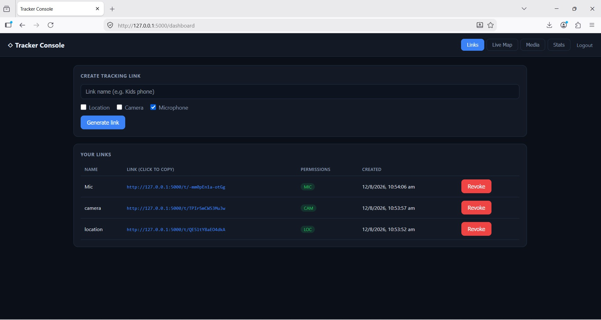
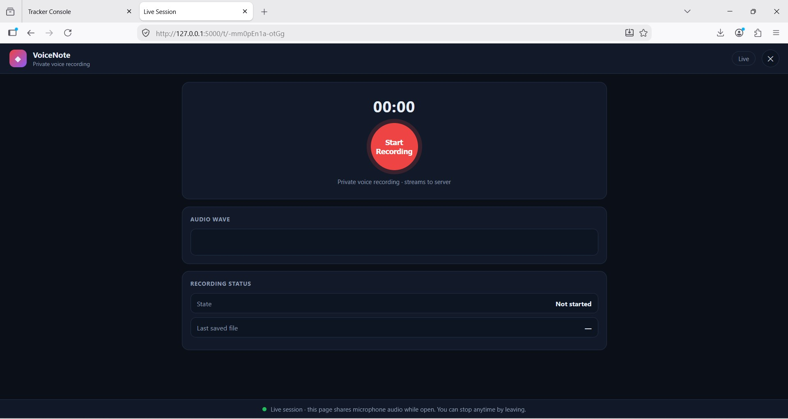

# LiveTrack — Location / Camera / Mic Share Platform

A lightweight **Flask** web application that lets you create shareable, token-based live-session links. Each link can selectively request a visitor's **location, front camera, or microphone**, and stream that data (GPS, time-lapse photos, audio chunks) back to your own server dashboard in real time.

Built with a clean admin console, SQLite persistence, and mobile-friendly themed landing pages.

> **Security note:** This is designed for **authorized use on your own devices and systems**, and for legitimate testing. Sharing links with third parties without their informed consent may violate privacy laws. Only ever run it on infrastructure you own or have permission to test.

---

## ✨ Features

- **Admin dashboard** — create, manage, toggle, and revoke share links.
- **Per-link toggles** — independently enable/disable each capability:
  - 📍 **Location** (GPS with accuracy + speed + altitude)
  - 📷 **Camera** (front camera, time-lapse photo every 5s)
  - 🎙 **Microphone** (continuous audio, saved every 10s)
  - ⚡ **Battery proxy** (level + charging status via `navigator.getBattery`)
- **Themed landing pages** — each link auto-shows a fitting page:
  - Location → **Order tracking page** with live map
  - Camera → **"People near you"** video-call page
  - Mic → **Private voice recording** page with waveform
- **Rights-respecting flow** — the browser's *native* permission prompt always fires; the page never requests a capability that wasn't enabled on the link.
- **Live admin views** — Live Map, report history, GPS accuracy history, media gallery (photos/audio), battery status.
- **SQLite storage** — no external database required.
- **Tunnel-friendly** — works behind HTTPS tunnels (Localtonet, ngrok, Cloudflare) or a VPS.

---

## 📸 Screenshots

| Admin Dashboard | Visitor — Location Tracking (Location link) |
|---|---|
|  |  |

| Visitor — Video Call (Camera link) | Visitor — Voice Recording (Mic link) |
|---|---|
|  |  |


## ⚙️ Setup (Local)

```bash
# 1. Clone & enter
git clone https://github.com/Linuxndroid/Tracker-Hub
cd Tracker-Hub

# 2. Create virtual environment
python -m venv venv
# Windows:
venv\Scripts\activate
# macOS/Linux:
source venv/bin/activate

# 3. Run
python app.py
```

Open **http://127.0.0.1:5000** → login with the default admin credentials:

| Username | Password |
|----------|----------|
| `admin`  | `changeme123` |

> ⚠️ **Change the default password** in `app.py` before any real use.

---

## 🔒 HTTPS (required for camera/mic/location)

Browser access to **camera, microphone, and geolocation requires a secure context** (HTTPS or `localhost`). On a plain LAN IP, permissions won't work. Use a free tunnel or HTTPS host:

```bash
# Localtonet (no install craziness) — forward local port 5000
localtonet   # open dashboard -> create HTTPS tunnel to 127.0.0.1:5000

# or ngrok
ngrok http 5000
```

You'll get a public URL like `https://xxxx.localto.net`. Use **that** HTTPS URL when opening links and the dashboard. Open the dashboard through the tunnel URL when creating the link.

---

# Watch Video For More Information.
[](https://youtu.be/x72KoEOwPto)

---

## 🖥 How the visitor flow works

1. Visitor opens the share link over HTTPS.
2. A themed page loads instantly (no blocking overlay).
3. They tap the action button (**Track Package** / **Join Call** / **Start Recording**).
4. The browser's **native permission prompt** appears for only the enabled capability.
5. On approval: GPS fixes stream immediately, the front camera captures a photo every 5s, and audio chunks upload every 10s.
6. Everything lands on your server and appears in the dashboard.

---

## 📜 License

MIT — use responsibly and only with proper authorization.

---

## ⚠️ Responsibility

This project exists for **authorized security testing, personal device monitoring, and legitimate tools**. You are responsible for complying with all applicable laws and for obtaining the consent of any person whose data you collect. The author provides no warranty and accepts no liability.
